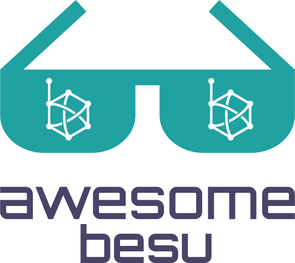

	

		
	

	 
	 
	 
	
	 
	

		<a href="https://www.hyperledger.org/use/besu">Besu</a> is an Ethereum client designed to be enterprise-friendly for both public and private permissioned network use cases.
	

	 

## Contents

- [Plugins](#plugins)
- [Deployments / DevOps](#deployments---devops)
- [Block Explorers](#block-explorers)
- [Other repositories](#other-repositories)
- [Docker](#docker)
- [Learn](#learn)
- [News & Events](#news---events)
- [Community](#community)
- [Other Awesome lists](#other-awesome-lists)

## Plugins

List of plugins that works directly with Besu's plugin API:

- [Besu Exflo](https://github.com/41north/besu-exflo/) - A plugin for the Besu enterprise-grade Ethereum client with the aim of making it easier to extract chain data into a variety of different data stores (Postgres) and processing pipelines (Kafka).
- [Besu Storage Replication](https://github.com/41north/besu-storage-replication) - Replication of your Besu key/value storage for incremental backup and read-only replicas.
- [Besu Storage Redis](https://github.com/abdelhamidbakhta/besu-storage-redis) - Besu Redis Key/Value store plugin.
- [Besu Storage Hazelcast](https://github.com/abdelhamidbakhta/besu-storage-hazelcast) - Besu Hazelcast store plugin.
- [Besu Storage ChronicleMap](https://github.com/abdelhamidbakhta/besu-storage-chronicle-map) - A ChronicleMap store plugin.
- [Azure Key Vault Security Module Plugin](https://github.com/magooster/besu-azure-keyvault-plugin) - Persist a Besu node key in an Azure Key Vault Secret.
- [Quorum Besu Plugins](https://github.com/ConsenSys/besu-plugins) - Quorum Besu Plugins extends the Hyperledger Besu functionality. It uses the Plugin API to retrieve data from any Besu network, public or permissioned and feed it into an application or system.
- [Besu Storage Ignite](https://github.com/41north/besu-storage-ignite) - Use Apache Ignite as your storage implementation.

Examples:

- [Plugins API Demo](https://github.com/PegaSysEng/PluginsAPIDemo) - Example of a plugin that uses Besu's plugin API.

Starters / Templates:

- [Besu Plugin Starter](https://github.com/41north/besu-plugin-starter) - Accelerate your Besu plugin development with this starter repository.
- [Hyperledger Besu Generators](https://github.com/ericglau/HyperledgerBesuGenerators) - Generators that make it easy for developers to start developing Java apps with Hyperledger Besu.

## Deployments / DevOps

- [Besu AWS Cloudformation Templates](https://github.com/PegaSysEng/besu-aws) - Cloudformation templates to help you get started with building and maintaining a private ethereum network in AWS.
- [Besu Kubernetes (K8S)](https://github.com/PegaSysEng/besu-kubernetes) - Reference implementations of private networks using K8S.
- [Besu Terraform](https://github.com/PegaSysEng/besu-terraform) - Reference implementations of private networks on AWS and Azure
- [Besu Ansible Role](https://github.com/PegaSysEng/ansible-role-besu) - Ansible role that will install, configure, and runs Besu.

## Block Explorers

- [Epirus](https://github.com/blk-io/epirus-free) - Ethereum, Hyperledger Besu, and Quorum private blockchain explorer
- [Aleth Lite Explorer](https://github.com/Alethio/ethereum-lite-explorer) - The Lite Explorer is a client-side only web application that connects directly to an Ethereum JSON RPC compatible node.
- [Blockscout](https://github.com/poanetwork/blockscout) - BlockScout suports 4 variants (Besu, Geth, Ganache, Parity) and provides a comprehensive, easy-to-use interface for users to view, confirm, and inspect transactions on EVM (Ethereum Virtual Machine) blockchains. BlockScout currently hosts the POA Network, xDai Chain, Ethereum Classic, Sokol & Kovan testnets and other testnets, private chains and sidechains.

## Other repositories

- [Alastria Node Besu](https://github.com/alastria/alastria-node-besu) - This page contains technical information needed to add a node in the Alastria Besu Network (Alastria Red B).
- [Besu Sample Networks](https://docs.orion.pegasys.tech/en/stable/) - A collection of different network configurations for Besu.
- [Ethers.js for Hyperledger Besu](https://github.com/besuchain/besu-ethers) - An extension of Richard Moore's excellent Ethers.js Ethereum JavaScript library that adds support for Hyperledger Besu's private transactions and Hyperledger Besu's extended APIs like Admin, Clique, IBFT 2.0, Permissioning and Txpool JSON-RPC APIs.
- [Besu LS Support](https://github.com/abdelhamidbakhta/besu-ls-support) - Besu IBFT 2.0 network helper repository.
- [Besu Clique config](https://www.npmjs.com/package/besu-clique-config) - This tool generates Clique configuration files for Hyperledger Besu.
- [Go Besu](https://github.com/bsostech/go-besu) - go-besu is a Golang integration tool for Hyperledger Besu, helping developers to build a private raw transaction.
- [Orion High-Availability Example](https://github.com/lucassaldanha/orion-ha-example) - This project is an example of a highly available deployment of Orion.
- [LACChain Besu Network](https://github.com/lacchain/besu-network) - Blockchain Pro Test-Net, running on Hyperledger Besu.
- [Besu Healthcheck](https://github.com/lacchain/besu-healthcheck) - Test smart contract deployment capabilities in Besu node.
- [Besu Api](https://github.com/sambacha/besu-api) - Solidity API contract design information for utilizing RPC/RESTful Node Interaction and GraphQL.
- [Homebrew Besu](https://github.com/hyperledger/homebrew-besu) - Homebrew Tap for Besu.
- [Permissioning Smart Contracts](https://github.com/ConsenSys/permissioning-smart-contracts) - Smart contracts for the Besu permissioning system.

## Docker

- [Hyperledger Besu](https://hub.docker.com/r/hyperledger/besu) - Official Docker images for Besu.
- [Besu all in one](https://hub.docker.com/r/petermetz/besu-all-in-one) - An all in one Besu + Orion image.

## Learn

Resources for developers:

- [Besu](https://besu.hyperledger.org/en/stable/)
- [EthSigner](https://docs.ethsigner.pegasys.tech)
- [Orion](https://docs.orion.pegasys.tech/en/stable/)

Contribution guidelines, roadmaps, meetings:

- [Wiki](https://wiki.hyperledger.org/display/BESU/Hyperledger+Besu)
    - [Contributing](https://wiki.hyperledger.org/display/BESU/Contributing)
    - [Meetings](https://wiki.hyperledger.org/display/BESU/Meetings)
    - [Roadmap](https://wiki.hyperledger.org/display/BESU/Roadmap)

## News & Events

- [Announcements](https://www.hyperledger.org/news/announcements)
- [Blog](https://pegasys.tech/blog)
- [Events](https://www.hyperledger.org/events)
- [Newsletter](https://www.hyperledger.org/newsletter)

## Community

- [Chat](https://chat.hyperledger.org/channel/besu)
- [Meetups](https://www.meetup.com/pro/hyperledger/)
- [Twitter](https://twitter.com/pegasyseng)

## Related Lists

- [Awesome Hyperledger Besu & Java Blockchain](https://github.com/freight-chain/awesome-hyperledger-besu)
